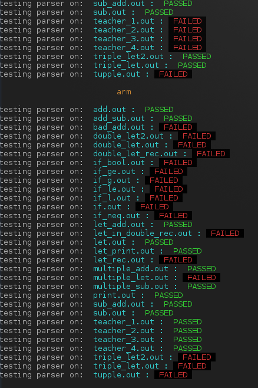
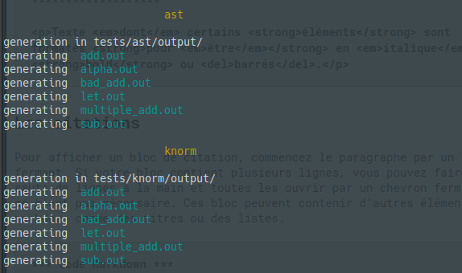
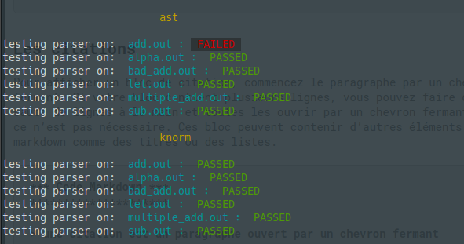

# README for the Compiler Project of the Cons Pileurs
As requested, you have to be located in the root folder

# Previous important remarks
- Our project is able to produce arm and able to produce asml. We have also created our own intermediate langage (Jerry), because we thought it would be more interesting to program own langage to figure out what were the constraint that we wouldn't have thought to otherwise.
- Sometimes some tests, as add_sub.out work and sometimes not, due to register allocation (which might change), __as you can see here__:    

#### Furthermore the generated arm can be launched by qemu-arm and return the expected values.

## General inforamtion
From this location, you can run the following commands :
- make *to compile the project*
- make clean *to clean all the .class (and other) generated by* make
- make test *to run the tests serie*
All these commands call other files located in the __java folder__ or the __script__ and __tests__ folders.

### For make test :
It process in two parts:
- It generates the output by executing the program on every testing input file
- It execute the test (by comparing the previously-generated) output and what we have

##### The generation-part should display something like :

##### The execution-part should display something like:

The subset of the language that is already implemented:
- Arithmetical Expressions
- call to print_int function
